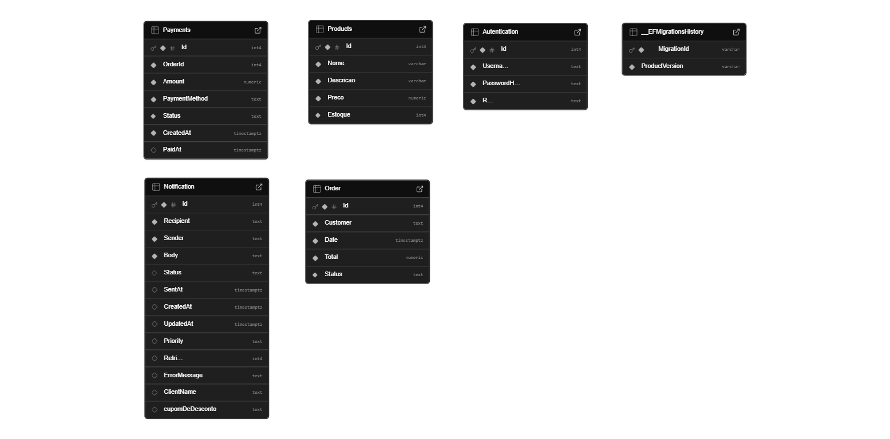

# Desenvolvimento da Aplicação

## Modelagem da Aplicação

# Estrutura da Aplicação

A aplicação é separada em 2 projetos:

## 1. Projeto API

Este projeto contém a parte de execução da aplicação, incluindo controladores, serviços, dados e arquivos de configuração.

### Pastas do projeto:

- **Connected Services, Dependencies, Properties**:  
  Pastas padrão do Visual Studio para gerenciar pacotes, serviços e propriedades do projeto.

- **Controllers**:  
  Onde estão definidos os controladores (endpoints) que expõem as rotas da API e recebem as requisições HTTP.

- **Data**:  
  Pasta para gerenciar o contexto do banco de dados e configurações de conexão.

- **Migrations**:  
  Contém as migrações do banco de dados geradas pelo Entity Framework Core.

- **Service**:  
  Aqui ficam as regras de negócio e lógica de serviço para abstrair a lógica dos controladores.

- **ViewModel**:  
  Modelos usados para transportar dados entre a API e a interface do usuário (por exemplo, objetos de resposta e requisição).

### Arquivos importantes:

- **API.http**:  
  Arquivo para testar as requisições HTTP diretamente pelo Visual Studio.

- **appsettings.json**:  
  Arquivo de configuração da aplicação, contendo informações como strings de conexão, chaves de API, etc.

- **Program.cs**:  
  Ponto de entrada da aplicação.

---

## 2. Projeto Model

Este projeto contém as entidades e modelos de domínio. Ele abstrai toda a parte de dados e está separado do projeto API para facilitar reuso e manutenção.

### Pastas do projeto:

- **Dependências, Autenticação, Cart, Notification, Order, Payments, Products**:  
  Pastas organizadas para cada domínio do sistema, separando as classes que representam as entidades e a lógica específica de cada área (por exemplo, autenticação, carrinho, pedidos, etc.).

### Arquivos importantes:

- **DefaultValues.cs**:  
  Contém os valores padrões do sistema. Por exemplo, um pedido pode estar em "processamento", "separação", "rota de entrega", "concluído" e "cancelado". Esses valores padrões são armazenados nessa classe.

## Tecnologias Utilizadas

- ASP.NET Core — framework para criação de APIs RESTful, robusto e de alto desempenho.

- C# — linguagem de programação utilizada no desenvolvimento da aplicação.

- Entity Framework Core (EF Core) — ORM (Object-Relational Mapper) para mapeamento das entidades e controle do banco de dados via migrations.

- PostgreSQL — sistema gerenciador de banco de dados relacional, utilizado para persistência dos dados.

- Supabase — plataforma de backend como serviço (BaaS) que hospeda o banco de dados PostgreSQL e oferece ferramentas adicionais.

- Swagger / OpenAPI — ferramenta integrada para documentação e teste dos endpoints da API.

- .NET CLI — interface de linha de comando para gerenciamento, execução, criação de migrations e atualização do banco.

- Npgsql — driver ADO.NET utilizado pelo EF Core para conectar aplicações .NET ao PostgreSQL.

- Git — sistema de controle de versão, essencial para versionamento do código e colaboração entre as equipes.

- Visual Studio / VS Code — ambiente de desenvolvimento (IDE) utilizado para escrever, editar e depurar o código.

## Programação de Funcionalidades

# Implementação do Sistema
---

## ✅ RF-001: Cadastro e Login de Usuário

**Descrição:**  
A aplicação permite que usuários se cadastrem e façam login.

**Artefatos criados:**  
- **API**  
  - `Controllers/AutenticacaoController.cs`  
- **Model**  
  - `Autenticacao`  

**Estruturas de dados:**  
- Entidade `Autenticacao` (armazenamento de dados de login, senha hash, etc.)

**Verificação:**  
- Testar endpoints:  
  - `POST /api/autenticacao/cadastrar`  
  - `POST /api/autenticacao/login`

---

## ✅ RF-002: CRUD de Produtos

**Descrição:**  
A aplicação permite criar, ler, atualizar e excluir produtos.

**Artefatos criados:**  
- **API**  
  - `Controllers/ProductsController.cs`  
- **Model**  
  - `Model.Products.Products.cs`

**Estruturas de dados:**  
- Entidade `Products`  
  - `Id (int)`: Identificador único do produto.  
  - `Nome (string)`: Nome do produto (obrigatório, até 100 caracteres).  
  - `Descricao (string)`: Descrição do produto (até 500 caracteres).
  - `Categoria (string)`: categoria do produto (até 100 caracteres)..
  - `Preco (decimal)`: Preço do produto (valor não negativo).  
  - `Estoque (int)`: Quantidade em estoque (valor não negativo).

**Verificação:**   
Testar endpoints:   
  - `POST /api/products`   
  - Fluxo esperado:  
    - Recebe um objeto `Products` no corpo da requisição.  
    - Valida os campos conforme anotações de data annotation.  
    - Persiste o produto no banco de dados.
    - Retorna `201 Created` com a localização do recurso criado.
    
  - `GET /api/products`   
  - Fluxo esperado:      
    - Retorna todos os produtos cadastrados.      
    - Pode ser combinado com filtros opcionais.
          
  - `GET /api/products/{id}`    
  - Fluxo esperado:  
    - Retorna os detalhes de um produto específico.    
    - Retorna 404 Not Found se o ID não existir.
            
  - `PUT /api/products/{id}`   
  - Fluxo esperado:      
    - Atualiza os dados de um produto existente com base no ID.    
    - Valida se o ID do corpo corresponde ao ID da URL.  
    - Retorna `204 No Content` se a atualização for bem-sucedida.    
    - Retorna `404 Not Found` se o produto não existir.  
           
  - `DELETE /api/products/{id}`    
  - Fluxo esperado:     
    - Exclui o produto com o ID especificado.    
    - Retorna `204 No Content` se a exclusão for bem-sucedida.    
    - Retorna `404 Not Found` se o produto não for encontrado.       

---
## ✅ RF-003: Filtro de Produtos por Categoria e Faixa de Preço

**Descrição:**
A aplicação permite ao usuário consultar produtos com base em filtros opcionais, como nome, categoria e faixa de preço mínima e máxima

**Artefatos criados:**
- **API**
  - `Controllers/ProductsController.cs`
- **Model**
  -`Model.Products.Products.cs`

**Estruturas de dados:**
- Entidade `Products`:
  - `Id (int)`: identificador único do produto.
  - `Nome (string)`: nome do produto.
  - `Descricao (string)`: descrição detalhada do produto.
  - `Categoria (string)`: categoria do produto.
  - `Preco (decimal)`: valor do produto.
  - `Estoque (int)`: quantidade disponível em estoque.

**Verificação:**  
Testar endpoint:  
  - `GET /api/products?nome=caneca&precoMin=10&precoMax=100&categoria=utilidades`  
  - Fluxo esperado:  
    - O endpoint aceita parâmetros opcionais: `nome`, `precoMin`, `precoMax`, e `categoria`.  
    - Filtra os produtos que:  
      - Contêm o termo nome no `nome`.  
      - Têm preço maior ou igual a `precoMin`.  
      - Têm preço menor ou igual a `precoMax`.  
      - Pertencem à categoria informada (comparação case-insensitive).  
      - Retorna uma lista de produtos correspondentes ao filtro, com status `200 OK.`

---
## ✅ RF-004: Gerenciamento de Carrinho de Compras
**Descrição:**
A aplicação permite ao usuário adicionar produtos ao carrinho, atualizar quantidades, visualizar os itens adicionados e remover produtos.

**Artefatos criados:**
- **API**
- `Controllers/CartController.cs`
- `Service/CartService.cs`
-  **Model
- `Cart/CartItem.cs`
- `Cart/Cart.cs`
  
**Estruturas de dados:** 
- Entidade `CartItem`
- `Id (int)`: identificador do item.
- `ProductId (int)`: ID do produto. 
- `Quantity (int)`: quantidade do produto.
- `CartId (int))`: identificador do carrinho a que o item pertence.
- - Entidade `Cart`
  - `Id (int)`: identificador do carrinho. 
  - `UserId (int)`: identificador do usuário. 
  - `Items (List<CartItem>)`:lista de produtos adicionados ao carrinho.
  - `CreatedAt (DateTime)`: Limpa todo o carrinho de um usuário.
    
 **Verificação:**
  - Testar endpoint:  
  - `POST /api/cart/add` Adiciona um produto ao carrinho.
  - `PUT /api/cart/update` Atualiza a quantidade de um item existente.
  - `GET /api/cart/{userId}` Retorna o carrinho do usuário.
  - `DELETE /api/cart/remove/{itemId}`Remove um item específico do carrinho.
  - `DELETE /api/cart/clear/{userId}`Limpa todo o carrinho de um usuário.

## ✅ RF-005: Cadastro de Pagamento

**Descrição:**  
A aplicação permite que seja realizado o cadastro de um novo pagamento. Todo pagamento criado inicia com o status "Pending".

**Artefatos criados:**  
- **API**  
  - `Controllers/PaymentsController.cs`  
- **Model**  
  - `Payments`

**Estruturas de dados:**  
- Entidade `Payments`  
  - `Id (int)`: identificador único do pagamento.  
  - `OrderId (int)`: identificador do pedido relacionado ao pagamento.  
  - `Amount (decimal)`: valor a ser pago.  
  - `PaymentMethod (string)`: método de pagamento, como "CreditCard", "Pix", ou "Boleto".  
  - `Status (string)`: status atual do pagamento, iniciado como "Pending".  
  - `CreatedAt (DateTime)`: data e hora em que o pagamento foi criado.  
  - `PaidAt (DateTime?)`: data e hora em que o pagamento foi efetuado, se aplicável.

**Verificação:**  
- Testar endpoint:  
  - `POST /api/payments`  

- Fluxo esperado:  
  - Recebe um objeto `Payments` no corpo da requisição.  
  - Define automaticamente o status como "Pending".  
  - Persiste o pagamento no banco de dados.  
  - Retorna `201 Created` com a localização do recurso criado.

---

## ✅ RF-007: Notificações sobre Pedidos e Atualizações

**Descrição:**  
Usuários recebem notificações importantes.

**Artefatos criados:**  
- **API**  
  - `Controllers/NotificationController.cs`  
  - `Service/NotificationService.cs`  
- **Model**  
  - `Notification/Notification.cs`

**Estruturas de dados:**  
- Entidade `Notification` vinculada ao usuário e ao pedido

**Verificação:**  
- Testar endpoints de envio e recebimento de notificações:  
  - `POST /api/notification/sendwelcomeemail`  
  - `POST /api/notification/sendstatuspurchase`

---

## ✅ RF-010: Consulta de Pagamento por ID

**Descrição:**  
A aplicação permite consultar um pagamento específico a partir do seu identificador único (ID).

**Artefatos criados:**  
- **API**  
  - `Controllers/PaymentsController.cs`  
- **Model**  
  - `Payments`

**Estruturas de dados:**  
- Entidade `Payments` (mesma estrutura definida no RF-005).

**Verificação:**  
- Testar endpoint:  
  - `GET /api/payments/{id}`  

- Fluxo esperado:  
  - Consulta o pagamento com base no ID fornecido.  
  - Se encontrado, retorna `200 OK` com os dados do pagamento.  
  - Se não encontrado, retorna `404 Not Found`.

---

## ✅ RF-011: Visualização de Status dos Pedidos

**Descrição:**  
A aplicação deve permitir que os usuários visualizem o status dos seus pedidos.

**Artefatos criados:**  
- **API**  
  - `Controllers/OrderController.cs`  
- **Model**  
  - `Order/Order.cs`  

**Estruturas de dados:**  
- Entidade `Order`  
  - `OrderId`: Chave primária.  
  - `Customer`: Nome do cliente.  
  - `Date`: Data do pedido.  
  - `Total`: Valor total do pedido.  
  - `Status`: Status atual do pedido.

**Verificação:**  
- Testar endpoints:  
  - `GET /api/order`  
    - Deve retornar todos os pedidos existentes, com os respectivos status.  
  - `GET /api/order/{orderId}`  
    - Deve retornar o pedido específico, permitindo visualizar seu status atual.

### Requisitos Atendidos

As tabelas que se seguem apresentam os requisitos funcionais e não-funcionais que relacionam o escopo do projeto com os artefatos criados:

### Requisitos Funcionais

|ID    | Descrição do Requisito | Responsável | Artefato Criado |
|------|------------------------|------------|-----------------|
|RF-001| A aplicação deve permitir que o usuário se cadastre e faça login | Barbara | Rota: /api/Autentication (GET, POST), /api/Autentication{id} (GET, PUT, DELETE), /api/Autentication/login (POST) e /api/Autentication/forgot-password (POST)|
|RF-002| A aplicação deve permitir que o vendedor cadastre e gerencie novas peças | Leni Rocha | Rotas: /api/Products (GET, POST), /api/Products/{id} (GET, PUT, DELETE)  |
|RF-003| A aplicação deve permitir que os usuários filtrem produtos por nome, categoria e/ou faixa de preço. | Leni Rocha | Rota: /api/Products?nome={nome}&precoMin={valor}&precoMax={valor}&categoria={categoria} (GET)|
|RF-004| A aplicação deve permitir que os usuários adicionem produtos ao carrinho, atualizem, visualizem e removam os itens | Felipe Fernandes | Rota: /api/cart/add, /api/cart/update, /api/cart/{userId}, /api/cart/remove/{itemId}, /api/cart/clear/{userId} |
|RF-007| Notificações sobre Pedidos e Atualizações | Matheus Canuto | Rota: /api/notification/sendwelcomeemail e /api/notification/sendstatuspurchase|
|RF-011| Visualização de Status dos Pedidos | Ana Clara | Rota: /api/order e /api/order/{orderId}|

