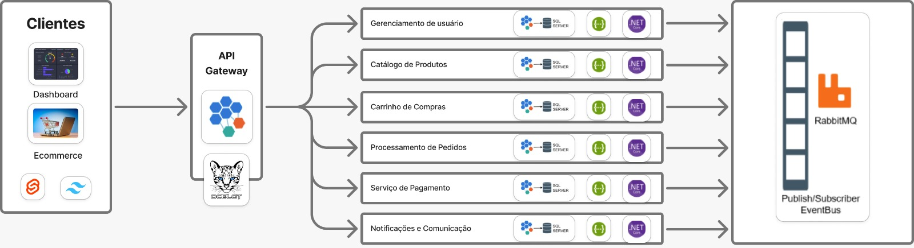

# Introdução

**Contextualização**

O mercado de artefatos antigos e colecionáveis tem experimentado um crescimento significativo nos últimos anos, impulsionado pelo aumento do interesse por história, cultura e objetos com valor simbólico. Esse mercado é vasto e diversificado, com colecionadores, museus, historiadores e entusiastas buscando peças raras e únicas. A demanda por artefatos autênticos e bem conservados, tanto para o uso pessoal quanto para investimento, está em alta. No entanto, esse mercado também enfrenta desafios, como a crescente dificuldade em diferenciar peças genuínas de réplicas e falsificações, o que gera desconfiança entre os compradores e dificulta a validação de um item como legítimo.

Diante desse cenário, surge a necessidade de uma plataforma especializada que não apenas ofereça artefatos antigos de diversas culturas e períodos históricos, mas também ofereça transparência e confiança ao consumidor. A *Ossos do Ofício* entra nesse mercado com uma proposta inovadora, unindo a paixão por história e a habilidade artesanal em uma plataforma online que garante a autenticidade das peças, ao mesmo tempo que oferece réplicas de alta qualidade para aqueles que buscam artefatos com valor estético e simbólico, mas com menor custo. Esse projeto visa preencher a lacuna existente entre o desejo dos consumidores por artefatos históricos e a dificuldade em acessar essas peças de forma segura e confiável.

## Problema

O mercado de artefatos antigos enfrenta um problema crescente: a dificuldade em garantir a autenticidade das peças e a transparência para os compradores. Muitos colecionadores e entusiastas têm dificuldades em identificar se os artefatos são genuínos ou falsificados, o que gera um ambiente de desconfiança e incerteza. Além disso, o preço elevado das peças autênticas limita o acesso de muitos consumidores que desejam adquirir artefatos com valor histórico, mas não têm recursos para investir em itens genuínos.

Este problema é exacerbado pela falta de plataformas especializadas que combinem segurança na autenticação de peças, ofereçam informações detalhadas sobre as origens dos artefatos e ao mesmo tempo disponibilizem réplicas de alta qualidade para quem busca artefatos acessíveis, mas igualmente ricos em valor simbólico e estético. O contexto envolve um mercado fragmentado, com compradores e vendedores muitas vezes sem acesso a informações claras e confiáveis, o que resulta em uma experiência de compra insatisfatória.

A aplicação será utilizada em um ambiente digital, com a integração de tecnologias que permitam a validação de autenticidade de artefatos e a criação de uma experiência de compra que atenda tanto colecionadores experientes quanto iniciantes. Nesse contexto, a necessidade de uma plataforma que resolva esses problemas de maneira clara e eficiente se torna urgente para garantir uma transação segura e satisfatória entre vendedores e compradores.

## Objetivos

Objetivo Geral

Desenvolver uma plataforma online chamada Ossos do Ofício, que facilite a compra e venda de artefatos antigos e colecionáveis, garantindo a autenticidade das peças e oferecendo réplicas de alta qualidade, atendendo às necessidades de colecionadores e entusiastas que buscam confiança e segurança nas transações de itens com valor histórico.

Objetivos Específicos

Implementar um sistema de validação de autenticidade de artefatos, utilizando tecnologias que permitam a certificação de peças autênticas e a criação de um banco de dados transparente para que os compradores possam verificar a procedência de cada item. Esse sistema deve combinar ferramentas como análise de características físicas dos artefatos e documentação digital.

Desenvolver uma interface amigável e intuitiva para o usuário, com foco na experiência de compra, categorização eficiente dos produtos e a oferta de informações detalhadas sobre cada artefato. A plataforma também deve permitir a compra de réplicas, oferecendo uma alternativa acessível para aqueles que não podem investir em itens originais, mas ainda desejam peças com alto valor estético e simbólico.

## Justificativa

O mercado de artefatos antigos movimenta bilhões de dólares anualmente, mas enfrenta um grande desafio: a autenticidade das peças. Estudos indicam que cerca de 30% dos itens vendidos como "antigos" são falsificados, gerando desconfiança entre compradores e vendedores. Além disso, 70% dos consumidores afirmam que a autenticidade é um fator crucial na decisão de compra.

A escolha dos objetivos específicos visa resolver esses problemas. Implementar um sistema de validação de autenticidade garantirá maior confiança para os compradores, enquanto uma interface intuitiva proporcionará uma experiência de compra mais acessível e segura. Com isso, buscamos atender a uma necessidade real do mercado, criando um ambiente mais transparente e confiável para a compra de artefatos antigos.

## Público-Alvo

A aplicação Ossos do Ofício será voltada para um público diversificado, composto por diferentes perfis de usuários com interesses e necessidades variadas. A seguir, são descritos os perfis de usuários que utilizarão a plataforma:

1. Colecionadores Experientes
Idade: 35-60 anos
Conhecimento Prévio: Grande familiaridade com artefatos históricos e colecionáveis. Possuem experiência na compra e venda de itens raros e são exigentes quanto à autenticidade das peças.
Relação com a Tecnologia: Confortáveis com o uso de plataformas digitais para compras online, mas preferem sites especializados e informativos, com autenticação clara e transparência.
Necessidades: Garantia de autenticidade das peças, informações detalhadas sobre as origens e estado de conservação, além de um ambiente seguro e confiável para transações.
2. Novos Colecionadores e Entusiastas
Idade: 20-40 anos
Conhecimento Prévio: Menos experientes em artefatos históricos, mas com forte interesse em aprender sobre arte e colecionismo. Podem estar começando suas coleções ou buscando peças específicas para decorar.
Relação com a Tecnologia: Usuários frequentes de plataformas digitais, geralmente fluentes em tecnologia, e confortáveis em realizar compras online.
Necessidades: Acessibilidade a informações claras sobre artefatos, opções de réplicas de alta qualidade a preços mais acessíveis, e uma interface fácil de navegar.
3. Curadores e Profissionais de Museus
Idade: 30-50 anos
Conhecimento Prévio: Profundo conhecimento histórico e técnico sobre artefatos e peças antigas. Muitos têm experiência na aquisição de itens para museus ou exposições.
Relação com a Tecnologia: Usuários experientes, mas preferem plataformas com foco em precisão e detalhes técnicos, não tanto em design ou conveniência.
Necessidades: Acesso a artefatos autênticos e informações documentadas de forma clara, para garantir a credibilidade das peças em suas coleções e exibições.
4. Vendedores e Artesãos de Réplicas
Idade: 25-50 anos
Conhecimento Prévio: Conhecimento técnico em técnicas de fabricação de réplicas e réplicas de artefatos históricos. Alguns podem ter experiência em vendas ou no mercado de artefatos antigos.
Relação com a Tecnologia: Familiaridade com plataformas online para a venda de produtos, mas podem precisar de suporte em relação à exposição de seus produtos de forma eficaz.
Necessidades: Plataforma para divulgar e vender réplicas de qualidade, com boas descrições e imagens, além de um sistema que os conecte a compradores interessados.
5. Investidores e Compradores de Arte
Idade: 40-65 anos
Conhecimento Prévio: Conhecimento sobre o mercado de arte e colecionáveis, com foco em peças de alto valor e potencial de valorização.
Relação com a Tecnologia: Moderada, utilizam plataformas digitais com foco em produtos de valor elevado e buscam mais informações sobre o histórico de uma peça antes de realizar a compra.
Necessidades: Garantia de que os artefatos oferecidos possuem valor real e histórico, com uma plataforma confiável e segura para realizar transações de alto valor.

# Especificações do Projeto

Esta seção do documento visa apresentar a definição do problema que a aplicação Ossos do Ofício se propõe a resolver, bem como as ideias iniciais para a solução a partir da perspectiva do usuário. Para isso, serão abordados os seguintes pontos: definição de personas, histórias de usuários, requisitos funcionais e não funcionais, além das restrições do projeto. Através dessas informações, será possível obter uma visão clara do que a aplicação precisará oferecer e como ela atenderá às necessidades dos seus usuários.

## Personas

1. O Dono da Loja – Lucas Almeida
Tem 39 anos, é empreendedor e apaixonado por história e antiguidades. Após anos colecionando artefatos raros, decidiu transformar sua paixão em um negócio, criando um e-commerce especializado na venda de itens históricos como fósseis, jarros antigos e decorações de alto padrão. Seu objetivo é tornar a loja uma referência no mercado de relíquias, garantindo autenticidade e exclusividade para seus clientes. Ele busca constantemente formas de melhorar a experiência do usuário no site e otimizar a logística para garantir segurança nas vendas.

2. O Cliente Colecionador – Eduardo Monteiro
Tem 45 anos, é empresário e historiador amador. Sempre foi fascinado por relíquias e fósseis autênticos, buscando constantemente expandir sua coleção pessoal. Apaixonado por história e arqueologia, ele valoriza peças com autenticidade comprovada e um bom histórico. Está em busca de um e-commerce confiável que ofereça artefatos exclusivos, como ossos de dinossauros e jarros antigos, para agregar valor ao seu acervo.

3. O Funcionário Responsável pelo Catálogo – Mariana Souza
Tem 32 anos, é gestora de e-commerce e trabalha diretamente na administração dos produtos da loja. Seu papel é cadastrar e atualizar as descrições dos artefatos, garantindo que todas as informações, imagens e certificações estejam corretas. Também auxilia no atendimento ao cliente, tirando dúvidas sobre autenticidade e procedência dos produtos. Mariana precisa de uma plataforma simples e intuitiva para gerenciar o catálogo com eficiência e garantir uma boa experiência para os compradores.

4. O Decorador de Luxo – Camila Rios
Tem 38 anos, é arquiteta e designer de interiores especializada em decoração de alto padrão. Seus clientes buscam peças exclusivas e sofisticadas, e ela sempre está à procura de elementos autênticos para compor seus projetos. Camila valoriza detalhes históricos e a estética refinada dos artefatos antigos, utilizando-os para criar ambientes únicos e sofisticados. Ela precisa de um site que ofereça imagens de alta qualidade e descrições detalhadas, além de um atendimento personalizado para encontrar peças que atendam às necessidades de seus projetos.

Enumere e detalhe as personas da sua solução. Para tanto, baseie-se tanto nos documentos disponibilizados na disciplina e/ou nos seguintes links:

## Histórias de Usuários

Com base na análise das personas forma identificadas as seguintes histórias de usuários:

| Eu como (Persona)            | Quero/Preciso (Funcionalidade)                      | Para (Motivo/Valor)                                      |
|-----------------------------|----------------------------------------------------|--------------------------------------------------------|
| Teórico da Conspiração      | Comprar um dente de alienígena                     | Provar que o governo esconde evidências extraterrestres |
| Mago de YouTube             | Adquirir uma varinha de plástico amaldiçoada       | Fazer feitiços duvidosos no meu canal                 |
| Colecionador de Bugigangas  | Encontrar a colher sagrada de Atlântida            | Completar minha coleção de relíquias improváveis      |
| Influencer Místico          | Comprar um cristal que brilha sozinho              | Criar vídeos virais sobre "energia cósmica"           |
| Cientista Maluco            | Adquirir um frasco de antimatéria (vazio)          | Dizer que tenho um experimento revolucionário         |

### Histórias de Usuários
- Teórico da Conspiração – O Caçador de Verdades Ocultas
  
Como Teórico da Conspiração, eu passo os dias conectando pontos que ninguém mais vê, investigando as verdades que "eles" não querem que saibamos. Eu quero comprar o Dente de Alienígena Classe Z, para que finalmente eu tenha uma prova irrefutável de que não estamos sozinhos no universo.
Meu maior desafio é convencer as pessoas de que este dente não é um simples pedaço de plástico perdido por um turista em Roswell.
Preciso de um sistema de autenticação de itens que me forneça "provas concretas" da origem extraterrestre dos produtos, com descrições detalhadas e certificados questionáveis de autenticidade.

- Mago de YouTube – O Feiticeiro do Algoritmo
  
Como Mago de YouTube, eu misturo misticismo e entretenimento para conquistar views e seguidores. Meu canal já testou feitiços de livros duvidosos, rituais proibidos e até a famosa "magia da cebola contra energias ruins". Agora, eu quero a Varinha de Plástico Amaldiçoada, para que meus truques pareçam reais e, quem sabe, eu finalmente consiga lançar um feitiço que não pareça um truque de festa infantil.
Meu maior desafio é fazer as pessoas acreditarem que esta varinha tem algum poder, além do de quebrar na terceira tentativa de feitiço. Preciso que os artefatos tenham uma descrição convincente e imagens bem trabalhadas para que eu possa mostrar no meu canal sem parecer um charlatão (mesmo sendo um).

- Colecionador de Bugigangas – O Acumulador de Lendas
  
Como Colecionador de Bugigangas, eu sou obcecado por artefatos misteriosos, curiosidades históricas e objetos sem nenhuma utilidade prática. Minha coleção já inclui a tampa de um sarcófago de plástico e um bilhete escrito por um monge em 2013 (mas que parece medieval). Agora, eu quero a Colher Sagrada de Atlântida, para que eu possa dizer a todos que possuo a única relíquia culinária do continente perdido.
Meu maior desafio é evitar que meus amigos descubram que a tal colher tem um código de barras e custou R$ 9,90.
Preciso de um catálogo organizado que me permita filtrar os artefatos por grau de obscuridade e estranheza, além de um sistema que me ajude a justificar para minha família porque estou comprando mais tralha.

- Influencer Místico – A Diva da Energia Cósmica
  
Como Influencer Místico, eu sou especialista em cristaloterapia, tarot e na arte de parecer iluminada em fotos de pôr do sol. Eu quero o Cristal que Brilha Sozinho, para que eu possa mostrar aos meus seguidores que minha energia é tão poderosa que os objetos ao meu redor simplesmente se iluminam.
Meu maior desafio é explicar porque o cristal só brilha quando está perto de uma tomada.
Preciso que o site tenha um layout harmonioso e esteticamente agradável para que eu possa tirar prints e divulgar no meu feed, além de descrições místicas que pareçam profundas, mesmo sem fazer sentido.

- Cientista Maluco – O Visionário Incompreendido

Como Cientista Maluco, eu vivo para desafiar as leis da física, misturar substâncias aleatórias e tentar construir dispositivos que nem eu sei como funcionam. Eu quero o Frasco de Antimatéria (Vazio), para que eu possa tentar preenchê-lo e revolucionar a ciência, ou pelo menos assustar meus vizinhos.
Meu maior desafio? Descobrir como um frasco pode estar "vazio" de algo que não deveria existir em primeiro lugar.
Preciso de uma seção no site dedicada a "achados científicos" para que eu possa adquirir itens bizarros sem que pareça que estou apenas comprando lixo caro.

## Requisitos

As tabelas que se seguem apresentam os requisitos funcionais e não funcionais que detalham o escopo do projeto.

### Requisitos Funcionais

|ID    | Descrição do Requisito  | Prioridade | 
|------|-----------------------------------------|----| 
|RF-001| A aplicação deve permitir que o usuário se cadastre e faça login | ALTA |  
|RF-002| A aplicação deve permitir que o vendedor cadastre e gerencie novas peças  | ALTA | 
|RF-003| A aplicação deve permitir que os usuários filtrem produtos por categoria, autenticidade e faixa de preço.  | ALTA |
|RF-004| A aplicação deve permitir que compradores adicionem produtos a um carrinho de compras.  | ALTA |
|RF-005| A aplicação deve permitir que os usuários finalizem a compra através de um sistema de pagamento seguro.  | ALTA |
|RF-006| A aplicação deve exibir um histórico de compras para cada usuário. | MÉDIA |  
|RF-007| A aplicação deve enviar notificações aos usuários sobre status de pedidos e atualizações importantes. | ALTA | 
|RF-008| A aplicação deve permitir que os vendedores adicionem imagens e vídeos detalhados dos produtos. | MÉDIA |
|RF-009| A aplicação deve permitir que compradores solicitem a devolução de um produto dentro de um prazo determinado.  | BAIXA |
|RF-010| A aplicação deve permitir pagamentos via cartão de crédito, débito, Pix e boleto bancário.  | MÉDIA |

### Requisitos não Funcionais

|ID     | Descrição do Requisito  |Prioridade |
|-------|-------------------------|----|
|RNF-001| A aplicação deve ser responsiva | MÉDIA | 
|RNF-002| A aplicação deve processar requisições do usuário em no máximo 3s |  BAIXA | 
|RNF-003| O sistema deve suportar pelo menos 100 usuários simultâneos sem perda significativa de desempenho. | MÉDIA |
|RNF-004| A interface deve ser intuitiva, com um design responsivo que funcione em dispositivos móveis e desktops. | MÉDIA | 
|RNF-005| Incluir tutoriais e dicas interativas para ajudar os usuários a explorar as funcionalidades. | BAIXA |

## Restrições

O projeto está restrito pelos itens apresentados na tabela a seguir.

|ID| Restrição                                             |
|--|-------------------------------------------------------|
|01| O projeto deverá ser entregue até o final do semestre |
|02| A aplicação deve ser restrita à comercialização de artefatos antigos |
|03| Exige compatibilidade com tecnologias .Net e SQL Server |
|04| A plataforma não deve permitir pagamentos em dinheiro, apenas cartão e/ou pix |
|05| A aplicação deve funcionar adequadamente em dispositivos móveis e desktops |
|06| O projeto deve utilizar microsserviços |

# Arquitetura da Solução

Definição de como o software é estruturado em termos dos componentes que fazem parte da solução e do ambiente de hospedagem da aplicação.

## Tecnologias Utilizadas

### 📌 Tecnologias Utilizadas na Implementação da Solução
Para desenvolver a solução, utilizaremos uma arquitetura baseada em microserviços, garantindo escalabilidade, desempenho e modularidade. Abaixo estão as principais tecnologias e ferramentas empregadas:

### 🖥️ Linguagens e Frameworks
.NET Core – Utilizado para desenvolvimento dos microserviços.
C# – Linguagem principal para a implementação da lógica de negócio.
Svelte – Framework utilizado para o frontend da aplicação.
Tailwind css - Framework css para estilização
Redis – Banco de dados em memória para caching e otimização de performance.
### 🛠️ Serviços e Ferramentas
SQL Server – Banco de dados relacional para armazenamento persistente de dados.
RabbitMQ – Serviço de mensageria para comunicação assíncrona entre os microserviços, implementando um Event Bus.
API Gateway (provavelmente Ocelot ou Spring Cloud Gateway) – Responsável por rotear requisições entre clientes e microserviços, garantindo segurança e balanceamento de carga.
Docker e Kubernetes (se necessário) – Para orquestração e gerenciamento dos serviços em produção.
### 🖥️ IDEs e Ambientes de Desenvolvimento
Visual Studio / VS Code – Utilizados para desenvolvimento backend com C#/.NET.
Postman – Para testes de APIs REST.
Docker – Para containerização dos microserviços e suas dependências.

# Planejamento do projeto

##  Divisão de papéis

> Apresente a divisão de papéis entre os membros do grupo em cada Sprint. O desejável é que, em cada Sprint, o aluno assuma papéis diferentes na equipe. Siga o modelo do exemplo abaixo:

### Sprint 1
- _Scrum master_: Guilherme Henrique de Lima Machado
- Protótipos: Bárbara Xavier
- Testes: Felipe Fernandes
- Documentação: Ana Clara Lima Marçal, Bárbara Xavier Soares de Barros, Felipe Fernandes de Bellis Ruas, Guilherme Henrique de Lima Machado, Leni Rocha Bento e Matheus Henrique Marques Canuto

### Sprint 2
- _Scrum master_: Guilherme Henrique de Lima Machado
- Desenvolvedor _front-end_: Ana Clara Lima Marçal
- Desenvolvedor _back-end_: Matheus Henrique Marques Canuto
- Testes: Leni Rocha

### Sprint 3
- _Scrum master_: Bárbara Xavier
- Desenvolvedor _front-end_: Felipe Fernandes
- Desenvolvedor _back-end_: Guilherme Henrique de Lima Machado
- Testes: Matheus Henrique Marques Canuto
- Documentação: Ana Clara Lima Marçal, Leni Rocha Bento

##  Quadro de tarefas

### Sprint 1

Atualizado em: 19/03/2025

| Responsável   | Tarefa/Requisito | Iniciado em    | Prazo      | Status | Terminado em    |
| :----         |    :----         |      :----:    | :----:     | :----: | :----:          |
| Ana Clara       | Requisitos Funcionais | 07/03/2025     | 21/03/2025 | ✔️    | 14/03/2025      |
| Bárbara    | Histórias de Usuários    | 07/03/2025     | 21/03/2025 | ✔️    | 07/03/2025      |
| Leni        | Requisitos Não Funcionais  | 07/03/2025     | 21/03/2025 | ✔️    | 14/03/2025      |
| Guilherme        | Introdução e Objetivos |  07/03/2025     | 21/03/2025 | ✔️    | 07/03/2025      |
| Matheus        | Histórias de Usuários |  07/03/2025     | 21/03/2025 | ✔️    | 07/03/2025      |
| Matheus         | Tecnologias Utilizadas |  19/03/2025     | 19/03/2025 | ✔️    | 19/03/2025      |
| Ana Clara        | Planejamento do Projeto |  14/03/2025     | 21/03/2025 | 📝    | /2025      |
| Guilherme        | Diagrama da Arquitetura |  14/03/2025     | 21/03/2025 | 📝    | /2025      |
| Leni        | Restrições  | 21/03/2025     | 22/03/2025 | ✔️    | 21/03/2025      |

### Sprint 2

Atualizado em: 21/03/2025

| Responsável   | Tarefa/Requisito | Iniciado em    | Prazo      | Status | Terminado em    |
| :----         |    :----         |      :----:    | :----:     | :----: | :----:          |
| Ana Clara       | Página inicial   | 01/04/2025     | 07/04/2024 | 📝    | 05/04/2025     |
| Matheus Canuto        | CSS unificado    | 03/04/2025    | 10/04/2025 | 📝    | 12/04/2025                |
| Bárbara        | Página de login  | 01/04/2024     | 07/04/2024 | 📝     | 20/05/2025                |
| Felipe Fernandes        | Script de login  |  01/04/2024    | 12/04/2025 | 📝    | 10/05/2025      |
| Guilherme Machado        | Microsserviço de Pagamento  |  28/03/2024    | 12/04/2025 | 📝    |       |
| Leni Rocha       | Catálogo de Produtos  |  01/04/2025    | 30/04/2025 | 📝   |    /2025   |

Atualizado em: 23/03/2025

| Responsável   | Tarefa/Requisito | Iniciado em    | Prazo      | Status | Terminado em    |
| :----         |    :----         |      :----:    | :----:     | :----: | :----:          |
| Bárbara       | Implementação da API de autenticação   | 15/04/2025     | 22/04/2025 | 📝    | /2025     |
| Felipe Fernandes        | Validação e testes da API   | 17/04/2025    | 25/04/2025 | 📝    | /2025                |
| Guilherme        | Integração da API com o front-end | 18/04/2025     | 28/04/2025 | 📝    | /2025                |
| Matheus Canuto        | Ajustes finais e revisão de segurança  | 20/04/2025    | 30/04/2025 | 📝    | /2025      |
| Leni Rocha       | Testes de Produtos  |  01/04/2025    | 10/05/2025 | 📝   |   /2025    |
| Ana Clara        | Status dos Pedidos  |  28/04/2025    | 20/05/2025 | 📝   |   /2025    |
| Leni Rocha       | Verificação da documentação  |  15/05/2025    | 15/06/2025 | 📝   |    /2025   |

Legenda:
- ✔️: terminado
- 📝: em execução
- ⌛: atrasado
- ❌: não iniciado

## Processo

O desenvolvimento da plataforma Ossos do Ofício seguirá a metodologia Scrum, garantindo entregas contínuas e adaptação às necessidades dos usuários.

Planejamento e Levantamento de Requisitos – Definição de objetivos, funcionalidades e análise de concorrência. Criação do backlog e priorização das entregas.

Design e Prototipação – Desenvolvimento de wireframes, identidade visual e testes de usabilidade para validar a experiência do usuário.

Desenvolvimento e Implementação – Construção da plataforma com .NET Core (backend), Svelte + TypeScript (frontend) e SQL Server (banco de dados).

Testes e Validação – Testes unitários, de integração e segurança, garantindo funcionalidade e desempenho.

Implantação e Monitoramento – Hospedagem no Azure, monitoramento com Application Insights e implementação de CI/CD para atualizações contínuas.

Esse processo garante um desenvolvimento ágil e eficiente, focado na qualidade e experiência do usuário. 

## Ferramentas

Liste todas as ferramentas que foram empregadas no projeto, justificando a escolha delas, sempre que possível.

Exemplo: os artefatos do projeto são desenvolvidos a partir de diversas plataformas e a relação dos ambientes com seu respectivo propósito é apresentada na tabela que se segue.

| Ambiente                            | Plataforma                         | Link de acesso                         |
|-------------------------------------|------------------------------------|----------------------------------------|
| Repositório de código fonte         | GitHub                             | ICEI-PUC-Minas-PCO-SI/pco-si-2025-1-dad-pco-si-2025-1-dad-dad-project-template:master                         |
| Documentos do projeto               | GitHub                             | https://github.com/ICEI-PUC-Minas-PCO-SI/pco-si-2025-1-dad-g4-aplicacoes_distribuidas/tree/master/docs)                        |
 
